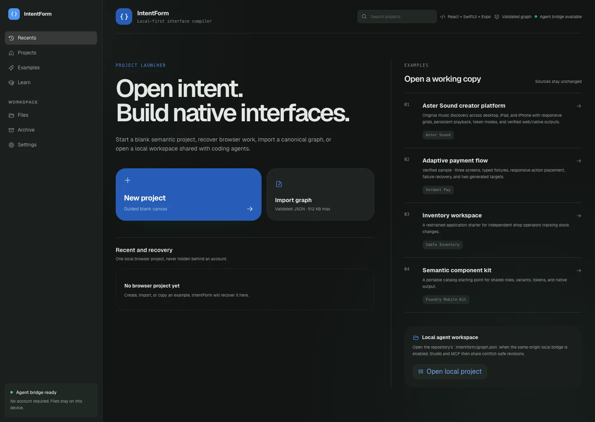
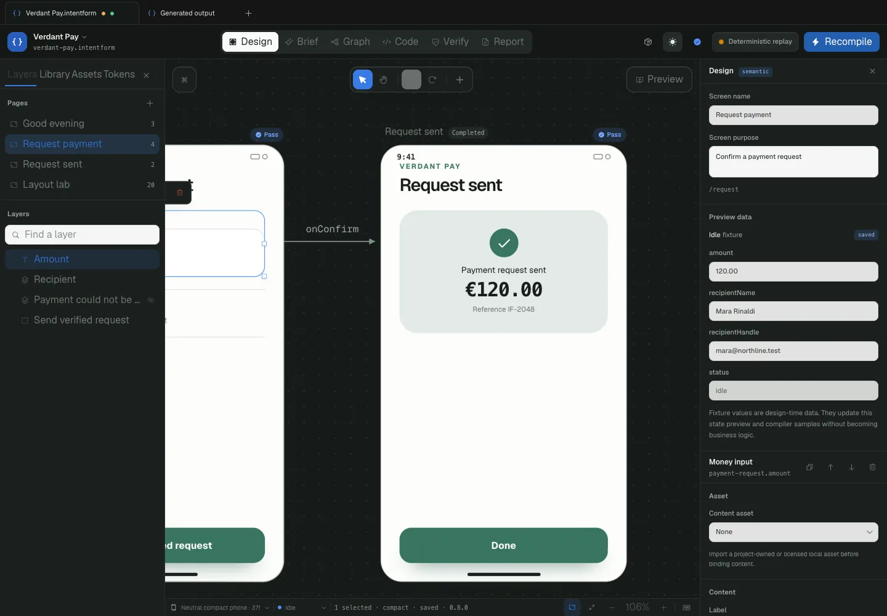
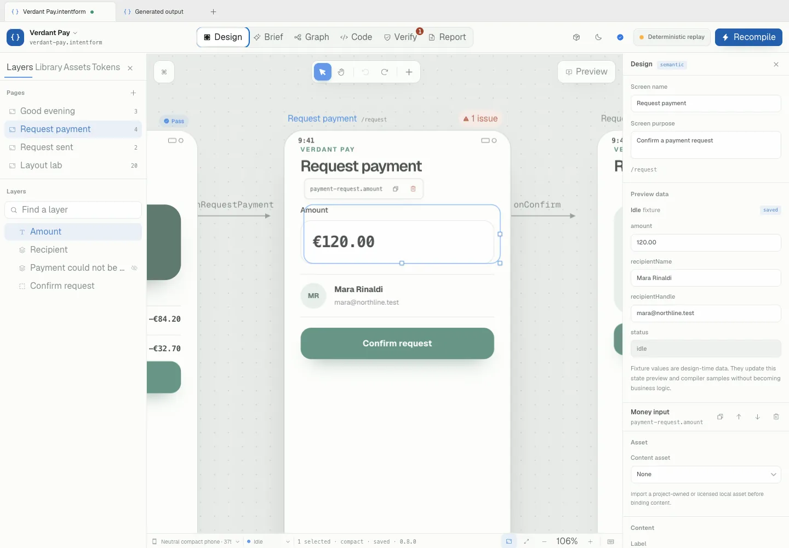
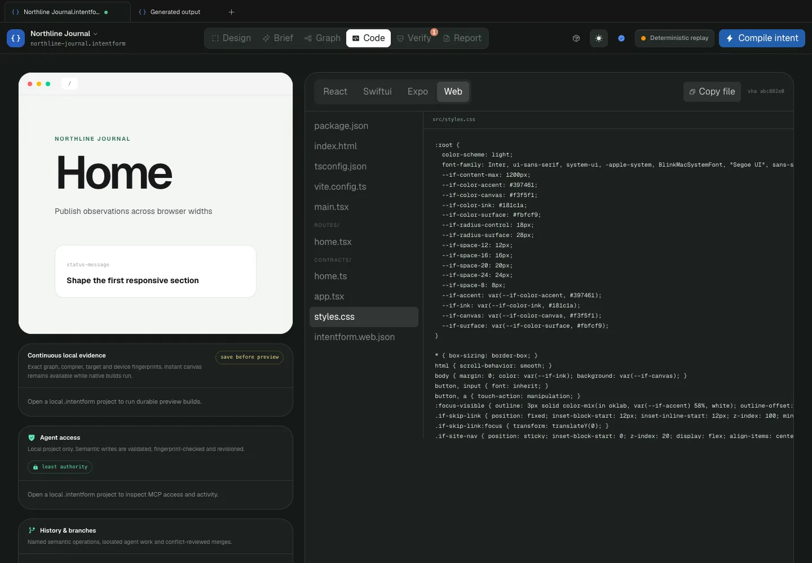
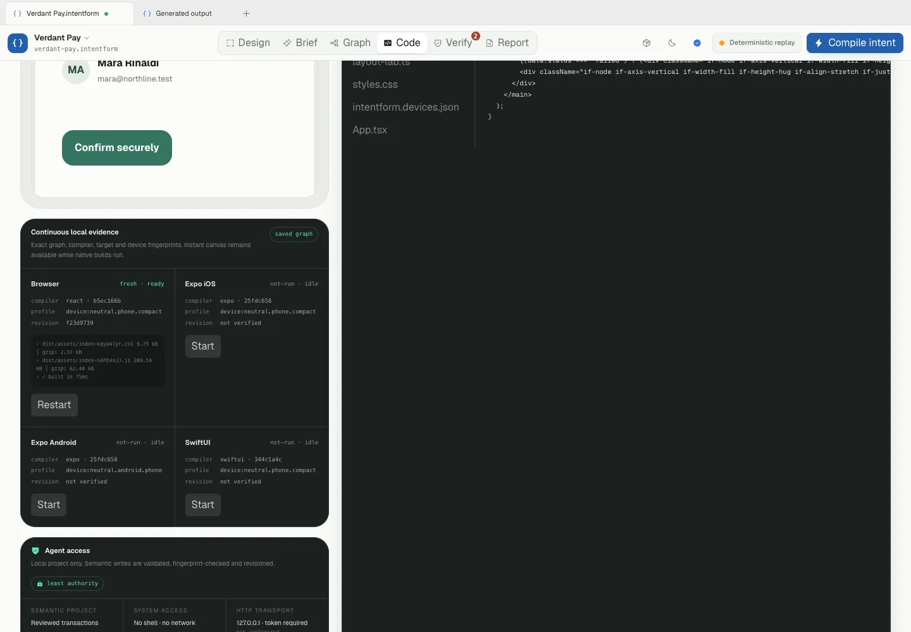

# IntentForm

**Design interfaces with humans and agents. Compile them into real software.**

IntentForm is an open-source, local-first visual design environment and interface compiler. A validated Semantic Interface Graph is the shared source of truth for people and coding agents; deterministic compilers produce readable React, HTML/CSS, Expo, and SwiftUI output; browser and native checks provide evidence before a result is called verified.



## What IntentForm is

- A desktop-class visual editor for semantic interface intent.
- A deterministic, versioned project format with migrations and stable fingerprints.
- A local MCP surface for Codex, Claude Code, OpenCode, Pi, and generic clients.
- A compiler pipeline that keeps generated code downstream of the canonical graph.
- A verification workflow for responsive layout, accessibility, generated builds, previews, and native rendering.

IntentForm is not a Figma clone, a screenshot-to-code service, or a promise of pixel-identical output across platforms. Native UI has platform-specific navigation, accessibility, type scaling, keyboard, safe-area, and control behavior. IntentForm preserves shared product intent while allowing honest platform expressions.

## The product today

| Area | Working | Experimental | Planned |
| --- | --- | --- | --- |
| Project lifecycle | Launcher, create/import/open, examples, atomic browser recovery, schema migration | Multi-document tab workflow | Directory-backed project catalog |
| Canvas | Infinite board, recursive layers, selection, resize, reorder, explicit freeform, device chrome | Multi-select grouping and semantic reparenting | Rich vector editing |
| Layout | Stack, frame, list, grid tracks/span, wrap, overlay, split, scroll, safe area, adaptive and freeform relations | Weighted tracks, negative gap where supported | Complete CSS compatibility matrix |
| Design systems | Components, slots, variants, states, overrides, detach/reset, assets, DTCG token modes | Local package and plugin ecosystem | Remote team libraries |
| Output | React, real DOM/CSS, responsive Web, Expo Router, SwiftUI | Agent handoff for unsupported native targets | Deterministic Compose compiler |
| Agents | 46 bounded tools, scoped resources, preview/commit/rollback transactions, semantic diffs, read-only default | Encrypted review bundles and collaboration relay | Multi-user presence |
| Evidence | Unit/integration tests, Playwright, WCAG profiles, web runtime, Expo exports, SwiftUI builds/renders, desktop package checks | Remote evidence verification | Hosted verification workers |



The editor chrome can be light, dark, or system-controlled without changing a project artboard’s authored theme.



## One source, several projections

```text
Human canvas edits ─┐
                    ├─> validated Semantic Interface Graph
Agent transactions ─┘              │
                                    ├─> React compiler ─> runnable app
                                    ├─> Web IR ─> DOM/CSS ─> browser evidence
                                    ├─> Expo compiler ─> iOS/Android exports
                                    └─> SwiftUI compiler ─> native build/render
```

Every committed mutation is schema-validated, fingerprint-bound, reversible, attributable, and represented as a semantic diff. Generated files are outputs; agents do not bypass the graph by editing generated code as the source of truth.



## Quick start

Requirements:

- Node.js 22 or newer
- pnpm 10.28.0
- Chromium for browser smoke tests
- Xcode command-line tools for SwiftUI and macOS checks

```bash
pnpm install --frozen-lockfile
pnpm dev
```

Open `http://127.0.0.1:3000`, create a project or copy an example, then enter Studio. An account, hosted service, model call, and paid MCP allowance are not required.

Useful focused commands:

```bash
pnpm typecheck
pnpm test
pnpm build
pnpm smoke:studio
pnpm verify:web-preview
pnpm verify:expo-preview
pnpm verify:swiftui
pnpm verify:desktop
```

## Project format

An `.intentform` project is canonical JSON validated by the versioned semantic schema. It contains:

- product intent and principles;
- design tokens and modes;
- assets with explicit export and license policy;
- component definitions and instances;
- screens, generic semantic nodes, layouts, states, contracts, fixtures, and flows;
- enabled platform profiles and precision preview devices;
- optional ecosystem, history, and collaboration metadata.

Bounds on serialized size, depth, child count, stable IDs, expressions, components, assets, frames, breakpoints, and patch operations fail closed. Migrations are explicit and fixture-backed; deterministic serialization produces canonical fingerprints.

## Agent setup

New MCP connections are read-only by default. Print a configuration plan without writing client files:

```bash
pnpm mcp:install --client codex --print
pnpm mcp:install --client claude --print
pnpm mcp:install --client opencode --print
pnpm mcp:install --client pi --print
```

Pass `--project /absolute/path/to/project` when the project is not the current directory. `--apply` installs the printed plan; an existing client configuration is never replaced without confirmation and a timestamped backup. Write access requires the explicit `INTENTFORM_MCP_PERMISSION=write` environment setting.

The agent surface includes high-level inspect, graph, component search, token, asset, branch, history, compile, verify, preview, accessibility, package, review, checkpoint, diff, revert, and transaction operations. Successful tool responses identify the project, file, tab, page, device, visual state, and selection scope.



## Original showcase

`Aster Sound` is an original fictional creator and listening product included in Examples. It demonstrates a responsive desktop library, tablet collection, phone discovery/player flow, original abstract cover surfaces, search, playlist rows, persistent playback, light/dark/compact token modes, responsive grids, three-screen flow, and Web/Expo/SwiftUI output. It includes no copyrighted music, competitor assets, external shader dependency, or placeholder copy.

Verdant Pay remains available as a clearly labeled verified compatibility sample for the original Build Week proof.

## Verification model

IntentForm separates generation from verification. A generated file is not called verified until current evidence exists for its exact graph, compiler, target, device/profile, and build fingerprint.

The release gate is:

```bash
pnpm verify
pnpm smoke:studio
pnpm verify:react-preview
pnpm verify:swiftui
pnpm verify:swiftui-render
pnpm verify:desktop
```

CI additionally regenerates checked-in preview harnesses and requires a clean diff, runs the 10,000-node benchmark, builds and smokes responsive Web output, exports Expo for iOS and Android, runs the full Studio browser matrix, verifies native SwiftUI evidence, and packages the macOS desktop shell. GitHub Actions are pinned to immutable commits.


## Security and local-first boundaries

- Project and revision state stays local by default.
- HTTP MCP binds to loopback and requires a private token.
- New agent clients receive read-only tools unless write access is explicitly granted.
- Graph patches are bounded, validated, fingerprint-checked, atomic, and reversible.
- Generated previews are isolated; generated Web output does not receive same-origin Studio access.
- Asset, package, bezel, plugin, review, and collaboration inputs are path-, checksum-, signature-, and size-checked.
- Logs exclude arguments, authored content, paths, credentials, tokens, and generated output.
- No arbitrary shell, filesystem, or network tool is exposed through the semantic MCP surface.
- The desktop package includes the project Apache license and NOTICE alongside Electron/Chromium legal material.

IntentForm can optionally use a live model for intent interpretation or repair planning, but deterministic replay remains available and core editing/compilation does not require an account or model call.

## Repository map

```text
apps/
  studio-web/          launcher, Studio, isolated previews, local APIs
  studio-desktop/      hardened Electron shell and local services
  react-preview/       generated React evidence harness
  web-preview/         generated responsive DOM/CSS harness
  expo-preview/        generated Expo Router export harness
packages/
  semantic-schema/     canonical graph, migrations, patches, diffs
  layout-engine/       deterministic neutral layout relations
  compiler-*/          React, Web, Expo, and SwiftUI backends
  device-registry/     checksummed logical and precision preview profiles
  mcp-server/          scoped resources, tools, transactions, transports
  verifier/            semantic and target evidence rules
scripts/               smoke, benchmark, native render, sync, installer gates
```

## Roadmap

Near-term work focuses on deeper professional workflows rather than a broad collection of tiny tools:

- complete searchable token binding and style clipboard interactions;
- richer selection traversal, keyboard manipulation, and cross-container drop targets;
- sandboxed browser-native HTML/CSS import with explicit unsupported-property diagnostics;
- simultaneous multi-device comparison inside Studio;
- expanded image crop/SVG editing and replacement workflows;
- deterministic native coverage beyond the current SwiftUI reference path.

## Build Week proof

The original vertical slice established the core claim: a product brief becomes a validated interface graph, a human or agent changes one semantic relationship, React and SwiftUI are generated without a required IntentForm runtime, and the output is checked against compact-device and accessibility rules. The productized repository extends that proof with a real launcher, local project lifecycle, recursive editor, Web/Expo/desktop paths, semantic history, MCP transactions, preview evidence, and a broader original showcase.

## Contributing

Keep changes narrow, deterministic, reversible, and test-backed. Add schema changes through explicit migrations. Do not treat generated files as the canonical source. Run targeted checks first, then the applicable release gates. Never commit secrets, machine-specific paths, local output, evidence, or private notes.

## License

IntentForm is licensed under Apache-2.0. See `LICENSE` and `NOTICE`.
