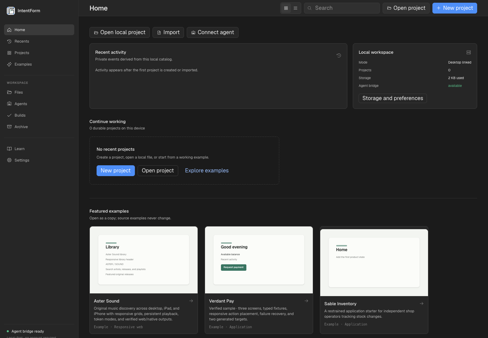
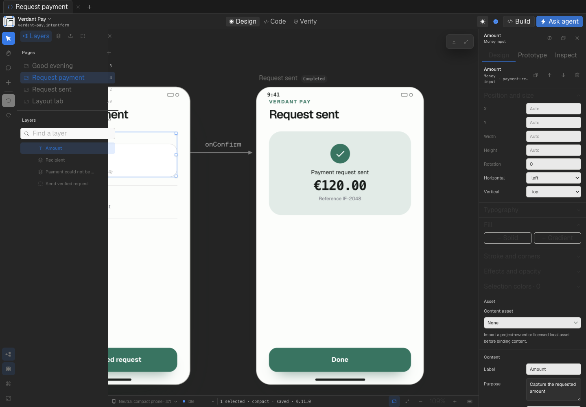
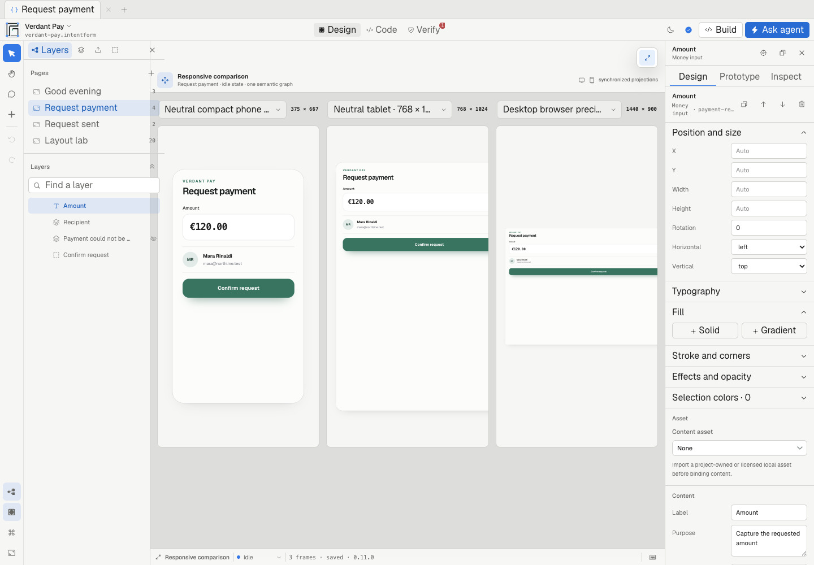
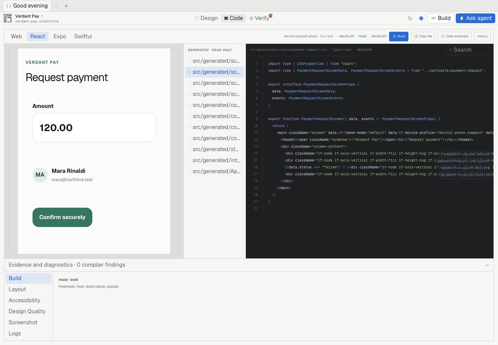
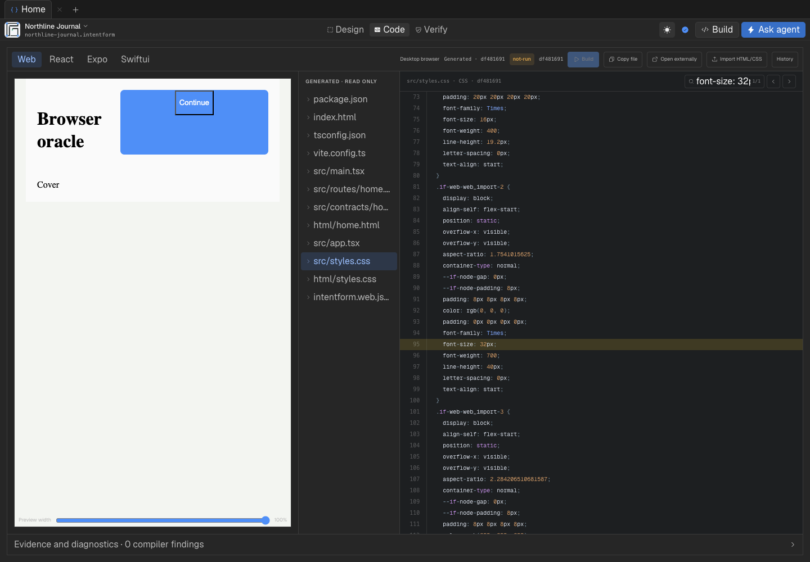

<p align="center">
  
</p>

<h1 align="center">IntentForm</h1>

<p align="center"><strong>Design interfaces with humans and agents. Compile them into real software.</strong></p>

<p align="center">
  <a href="https://github.com/metaforismo/IntentForm/actions/workflows/ci.yml"></a>
  <a href="LICENSE"></a>
  
</p>

IntentForm is an open-source, local-first visual design environment and deterministic interface compiler. People and coding agents edit the same validated Semantic Interface Graph; compilers lower that graph into readable React, responsive Web, Expo, and SwiftUI; verification stays separate from generation so output is never called proven without current evidence.



## Why IntentForm exists

Prompt-to-code tools usually bury design intent inside generated files. Traditional design tools usually stop before implementation. IntentForm keeps product intent as canonical, typed data between both worlds:

```text
Human canvas edits ─┐
                    ├─> validated Semantic Interface Graph
Agent transactions ─┘              │
                                    ├─> React compiler ─> runnable app
                                    ├─> Web compiler ───> DOM/CSS runtime
                                    ├─> Expo compiler ──> iOS/Android export
                                    └─> SwiftUI compiler > native build/render
```

Generated files are integration artifacts, not the source of truth. Every accepted mutation is schema-validated, fingerprint-bound, attributable, reversible, and represented as a semantic diff.

## Product today

| Area | Available now |
| --- | --- |
| Projects | Durable IndexedDB catalog, create/import/open, visual previews, search, grid/list views, folders, tags, rename, archive, recovery, migrations, multi-document tabs, dirty-close flows, and cross-window revision protection |
| Canvas | Infinite board, recursive layers, mixed selection, eight resize handles, rotation, snapping, keyboard movement, grouping, duplication, nested reparenting, conflict-safe inline text editing with IME/RTL support, context menus, clipboard and style clipboard, comments, flow preview, device chrome, and synchronized multi-device comparison |
| Layout | Stack, frame, list, grid tracks and span, wrap, overlay, split, scroll, safe area, adaptive, and freeform relations with deterministic layout indexes |
| Design systems | Components, instances, variants, states, slots, overrides, detach/reset, DTCG token modes, searchable token binding, licensed assets with integrity recovery, image placement, and SVG paint editing |
| Web workflows | Responsive frames and breakpoints, generated DOM/CSS runtime, sandboxed HTML/CSS import through computed styles, explicit unsupported-property diagnostics, and source-to-canvas navigation |
| Native output | Deterministic React, Web, Expo Router, and SwiftUI compilers with readable generated files and target capability diagnostics |
| Agents | Local MCP resources and bounded tools, read-only default, exact file/page/selection scope, preview/commit/reject/revert transactions, semantic diffs, comments, history, checkpoints, and rollback |
| Evidence | Unit and integration tests, accessibility profiles, Playwright production smoke, responsive runtime checks, Expo iOS/Android exports, SwiftUI builds and Simulator accessibility/screenshots, desktop packaging, and a 10,000-node benchmark |



The editor chrome is deliberately neutral. Blue is reserved for selection and editing, green for connected or verified state, and the authored project keeps its own visual identity.



## Quick start

Requirements:

- Node.js 22 or newer
- pnpm 10.28.0
- Chromium for browser smoke tests
- Xcode command-line tools for SwiftUI and macOS verification

```bash
pnpm install --frozen-lockfile
pnpm dev
```

Open `http://127.0.0.1:3000`, create a project or copy an example, then enter Studio. Core editing, compilation, deterministic replay, and local agent workflows require no account, hosted service, model call, or paid MCP allowance.

Focused checks:

```bash
pnpm typecheck
pnpm test
pnpm benchmark:large-doc
pnpm build
pnpm smoke:studio
pnpm verify:web-preview
pnpm verify:expo-preview
pnpm verify:swiftui
pnpm verify:swiftui-render
pnpm verify:desktop
```

The complete portable gate is `pnpm verify`; native and desktop gates run separately where their platform toolchains are available.

## The project format

An `.intentform` project is canonical JSON validated by the versioned semantic schema. It includes:

- product intent and principles;
- tokens, modes, aliases, and deprecations;
- assets with explicit export and license policy;
- component definitions, variants, slots, instances, and overrides;
- screens, recursive semantic nodes, layout relations, states, contracts, fixtures, and flows;
- platform, breakpoint, device, and preview profiles;
- optional ecosystem, history, review, and collaboration metadata.

Serialized size, graph depth, child count, stable IDs, expressions, components, assets, frames, breakpoints, and patch operations are bounded and fail closed. Migrations are explicit and fixture-backed. Stable serialization produces canonical fingerprints used by compilers, evidence, history, and agent transactions.

## Agent-native workflow

IntentForm does not give agents a privileged path around the editor. Studio and MCP use the same graph validation, project revisions, semantic diff, compilation, and verification operations.

Print an MCP configuration plan without modifying a client:

```bash
pnpm mcp:install --client codex --print
pnpm mcp:install --client claude --print
pnpm mcp:install --client opencode --print
pnpm mcp:install --client pi --print
```

Use `--project /absolute/path/to/project` when necessary. Add `--apply` only after reviewing the plan. Existing client configuration is not replaced without confirmation and a timestamped backup.

New connections are read-only. Semantic writes require the explicit `INTENTFORM_MCP_PERMISSION=write` environment setting. Tools cover project inspection, graph search, typed patches, components, tokens, assets, branches, history, compile, verify, preview, accessibility, packages, review, checkpoint, diff, revert, and transactions. Successful operations report project, file, tab, page, device, visual state, selection, affected node paths, and fingerprints.



## Compilation and verification

IntentForm separates these states:

1. Graph accepted by the schema.
2. Target source generated deterministically.
3. Generated project built successfully.
4. Runtime or native frame inspected against exact fingerprints.
5. Evidence verdict produced for the active target and profile.

The Studio Code workspace provides a virtualized, syntax-aware source viewer with search, exact node links, copy context, and source-to-canvas navigation. Verify groups semantic, responsive, accessibility, browser, Expo, SwiftUI, and desktop evidence without pretending that one target proves another.



CI runs typecheck, the complete test suite, the 10,000-node benchmark, production builds, Web runtime smoke, Expo exports for iOS and Android, the full Studio browser matrix, checked-in preview drift checks, SwiftUI native build/render evidence, and the hardened macOS desktop package. GitHub Actions are pinned to immutable commits.

The large-document gate measures serialization, open/index/edit/diff/layout/codegen work, pan and zoom queries, bounded cache retention, and a deterministic simulated 60-minute session. Browser smoke also covers interrupted catalog recovery, multi-window conflicts, reload restoration, reduced motion, RTL, forced colors, 200% text, compact and tablet layouts, and request races.

## Architecture

```text
apps/
  studio-web/          launcher, editor, isolated previews, local APIs
  studio-desktop/      hardened Electron shell and local services
  react-preview/       generated React evidence harness
  web-preview/         generated responsive DOM/CSS harness
  expo-preview/        generated Expo Router export harness
packages/
  semantic-schema/     canonical graph, migrations, patches, diffs
  layout-engine/       deterministic neutral layout relations
  compiler-*/          React, Web, Expo, and SwiftUI backends
  device-registry/     logical and checksummed precision profiles
  mcp-server/          scoped resources, tools, transactions, transports
  verifier/            semantic and target evidence rules
scripts/               smoke, benchmark, native render, sync, installer gates
```

IntentForm owns interface structure, tokens, navigation intent, visual state, typed data and event contracts, accessibility, compilation, and verification. It does not own backend behavior, authentication, payments, deployment, or arbitrary application logic.

Compilers remain deterministic: the same graph and compiler version produce byte-identical files. Restricted expressions cannot contain arbitrary JavaScript. Platform backends lower shared intent to native primitives and disclose unsupported relations rather than silently inventing them.

## Security and local-first boundaries

- Project and revision state stays local by default.
- Browser projects use IndexedDB, atomic revisions, project-scoped locks, recovery checkpoints, and explicit conflict errors.
- HTTP MCP binds to loopback and requires a private token.
- New agent clients receive read-only tools unless write access is explicitly granted.
- Graph patches are bounded, validated, fingerprint-checked, atomic, and reversible.
- Generated previews are isolated; imported HTML/CSS runs in a sandboxed browser document.
- Asset, package, bezel, plugin, review, and collaboration inputs are path-, checksum-, signature-, and size-checked.
- Logs exclude authored content, credentials, tokens, generated output, and machine-specific paths.
- The semantic MCP surface exposes no arbitrary shell, filesystem, or network operation.
- Production responses enforce content security, framing, permission, referrer, and content-type policies.
- The desktop package includes the project Apache license and NOTICE beside Electron/Chromium legal material.

Optional live-model operations are server-side, bounded, schema-validated, cancelled on deadline, and redacted to request metadata. Deterministic replay remains available without credentials. Public deployments should remain replay-first until quotas are durable across instances.

Report security issues privately through [GitHub Security Advisories](https://github.com/metaforismo/IntentForm/security/advisories/new). Do not open a public issue for credential exposure, code execution, quota bypass, or supply-chain findings. IntentForm is pre-release software and should not process production financial or personal data.

## Deployment

The repository deploys from the monorepo root. `vercel.json` uses the frozen lockfile and the same production build used locally.

```bash
vercel deploy
vercel deploy --prod
```

Run the browser matrix against a deployed revision with:

```bash
STUDIO_ORIGIN=https://your-deployment.example pnpm smoke:studio
```

A deployment is not considered public merely because its build is ready; verify from a clean browser that team SSO or deployment protection does not intercept the product. Keep `OPENAI_API_KEY` unset for the replay-first public baseline unless a durable shared quota and provider spend limit are configured.

## Honest boundaries and roadmap

IntentForm is not a Figma clone, a screenshot-to-code service, or a promise of pixel-identical output across platforms. Native UI has platform-specific navigation, accessibility, text scaling, keyboard, safe-area, and control behavior. The product preserves shared intent while allowing explicit platform expressions.

Current high-value work still includes:

- directory-backed catalog sync and richer filesystem workflows;
- multi-range rich-text authoring, deeper bidirectional layout controls, and variable-font axis editing;
- destructive crop, vector-pen, and SVG geometry workflows beyond the current non-destructive image framing and SVG paint controls;
- broader CSS compatibility and editable HTML/CSS round-trip coverage;
- code-component registration and library update review;
- a deterministic Compose backend;
- multi-user presence and hosted verification workers;
- continuing canvas-to-output layout fidelity work across font metrics and platform-native measurement.

## Contributing

Keep changes narrow, deterministic, reversible, and test-backed.

1. Create a focused branch and use a conventional commit subject.
2. Add schema changes through explicit migrations and fixture coverage.
3. Never edit generated output as the canonical source.
4. Run targeted tests first, then the applicable release gates.
5. Explain the preserved intent, affected compiler targets, verification, and honest limitations in the pull request.
6. Never commit secrets, machine-specific paths, local output, private notes, DerivedData, or simulated evidence presented as real.

Changing UI labels, roles, or test IDs requires updating the production smoke matrix in the same change. Compiler output must not depend on timestamps, randomness, or ambient environment state.

## License

IntentForm is licensed under [Apache-2.0](LICENSE). See [NOTICE](NOTICE) for attribution details.
