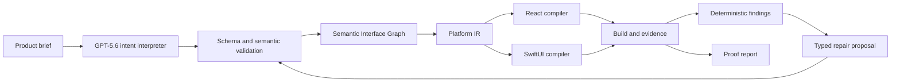

# Architecture

## Boundary

IntentForm owns interface structure, tokens, navigation intent, visual state, typed data and event contracts, accessibility, compilation and verification. It does not own backend behavior, deployment, authentication, payments, or arbitrary application logic.

## Source of truth

The Semantic Interface Graph is canonical. Generated files are readable integration artifacts and may be replaced on the next compilation. The current schema version is `0.1.0`; every persisted graph is runtime-validated before patches, code generation or verification.

Key invariants:

- stable IDs do not depend on labels, order or coordinates;
- expressions use a restricted AST and cannot contain JavaScript;
- shared intent is distinct from platform overrides;
- serialization and file fingerprints are deterministic;
- repair operations target stable IDs and increment provenance revisions;
- codegen never writes outside its declared generated file set.

## Pipeline

## Model boundary

GPT-5.6 is used only for interpretation and repair judgment. Both calls use Responses API structured output, bounded tokens, explicit timeout and schema validation. The fallback sample is deterministic and clearly labelled. Reasoning chains are neither requested nor persisted.

## Compiler boundary

Each backend implements capabilities, lowering, file generation and diagnostics. Lowering converts semantic relations into target-native primitives. The compact primary action becomes responsive fixed positioning in React and a bottom safe-area inset in SwiftUI. Freeform coordinates are not part of the current graph.

## Manual canvas boundary

The browser Studio now exposes the graph through a direct semantic editor: pages and layers, selectable canvas nodes, contextual content/layout/style controls, component insertion, ordering and undo/redo. Dragging a primary action vertically does not persist a `y` coordinate; crossing the gesture threshold changes compact placement between the semantic stack and `persistent-bottom` safe-area anchoring. Every accepted edit is parsed again before it becomes canonical and immediately changes deterministic compiler output.

This is an Instant Canvas, not a native rendering claim. The checked-in runnable React artifact remains the golden sample, while SwiftUI Simulator rendering remains the authority for native output.

## Verification boundary

The Build Week slice combines deterministic graph and build evidence with a real browser-render adapter. Playwright executes the generated React application, follows the home-to-request-to-receipt flow, captures screenshots, reads computed positioning and records primary-action bounds at compact and regular viewports. A finding contains target, screen, violated intent, responsible layer and evidence.

A repair is accepted only after validation, recompilation, the same rendered check rerunning and no remaining blocking finding. The native adapter builds and installs a versioned host app, launches it in an available iPhone Simulator, captures a real screenshot and reads the foreground app accessibility tree. It resolves the primary action through the compiler-authored semantic identifier, records point-space bounds and runs the same reachability and minimum-target verifier used by React. macOS CI uploads the screenshot and structured report as a native evidence artifact.

## Security and cost controls

- OpenAI credentials are server-only.
- Anonymous requests are bounded by session and process-wide quotas.
- Requests have a 45-second cancellation deadline.
- Replay works when the API is absent or quota is exhausted.
- The graph cannot execute arbitrary code.
- CI scans source and bundles through ordinary build boundaries; no secrets are committed.
