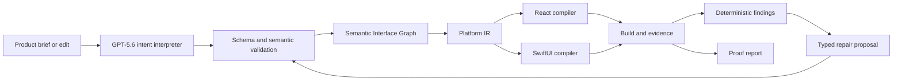

# Architecture

## Boundary

IntentForm owns interface structure, tokens, navigation intent, visual state, typed data and event contracts, accessibility, compilation and verification. It does not own backend behavior, deployment, authentication, payments, or arbitrary application logic.

## Source of truth

The Semantic Interface Graph is canonical. Generated files are readable integration artifacts and may be replaced on the next compilation. The current schema version is `0.1.0`; every persisted graph is runtime-validated before patches, code generation or verification.

Key invariants:

- stable IDs do not depend on labels, order or coordinates;
- expressions use a restricted AST and cannot contain JavaScript;
- shared intent is distinct from platform overrides;
- serialization and file fingerprints are deterministic;
- repair operations target stable IDs and increment provenance revisions;
- codegen never writes outside its declared generated file set.

## Pipeline

## Model boundary

GPT-5.6 is used only for graph creation, scoped semantic edits and repair judgment. Calls use Responses API structured output, `reasoning.effort: medium`, low verbosity, bounded tokens, a 45-second cancellation deadline and one corrective retry. A graph result must satisfy schema invariants; a patch must also resolve every stable target and token before it is accepted. Traces retain only request ID, input fingerprint, attempt count and token totals. Prompts, secrets, raw provider errors and reasoning chains are neither exposed nor persisted.

## Compiler boundary

Each backend implements capabilities, lowering, file generation and diagnostics. Lowering converts semantic relations into target-native primitives. The compact primary action becomes responsive fixed positioning in React and a bottom safe-area inset in SwiftUI. Freeform coordinates are not part of the current graph.

## Manual canvas boundary

The browser Studio exposes every screen as a frame on one infinite world-space board. Flow arrows are derived from graph transitions and verification badges attach findings to their screen frames. Pages and searchable layers, contextual content/layout/style/token controls, insertion, duplication, ordering and undo/redo surround the board. Pointer-anchored zoom, trackpad pan, Space hand mode, fit shortcuts, a searchable command menu and interactive flow preview provide an editor-grade manual workflow. Workspace panels collapse on wide viewports and become scoped drawers when space is tighter.

The canvas resolves node state bindings against the selected visual fixture before rendering, so a failed-only recovery message never leaks into the idle preview. Compact and regular device profiles select the corresponding placement relation. Dragging a primary action vertically does not persist a `y` coordinate; crossing the gesture threshold changes the currently previewed breakpoint between the semantic stack and `persistent-bottom` safe-area anchoring. Every accepted edit is parsed again before it becomes canonical and immediately changes deterministic compiler output.

This is an Instant Canvas, not a native rendering claim. Outputs also contains an active React preview: the child validates the posted graph, independently recompiles it to confirm the exact source fingerprint, lowers the shared IR, and renders that IR without evaluating arbitrary generated code. The separate Vite application remains the browser build/evidence harness, while SwiftUI Simulator rendering remains the authority for native output.

The browser may cache the most recent graph as a local draft. Restoration always goes through `parseGraph`; invalid storage is discarded and storage failures leave the in-memory validated graph untouched. The serialized project graph remains the product source of truth, not browser UI state.

## Verification boundary

The Build Week slice keeps graph checks, source generation, builds and rendered evidence as distinct states. The Studio fails closed as `not-run` because it does not ingest fresh graph-specific CI or Simulator evidence. Separately, the reproducible evidence scripts build the generated React application; Playwright follows the home-to-request-to-receipt flow, captures screenshots, reads computed positioning and records primary-action bounds at compact and regular viewports. A finding contains target, screen, violated intent, responsible layer and evidence.

A repair is accepted only after validation, recompilation, the same rendered check rerunning and no remaining blocking finding. The native adapter builds and installs a versioned host app, launches it in an available iPhone Simulator, captures a real screenshot and reads the foreground app accessibility tree. It resolves the primary action through the compiler-authored semantic identifier, records point-space bounds and runs the same reachability and minimum-target verifier used by React. macOS CI uploads the screenshot and structured report as a native evidence artifact.

## Security and cost controls

- OpenAI credentials are server-only.
- Anonymous live requests are bounded by session and process-wide quotas; those controls are not durable across serverless instances, so the public deployment stays replay-only.
- Client address and session are combined for the per-session bucket; malformed limits fall back to safe defaults.
- Requests have a 45-second cancellation deadline.
- Replay works when the API is absent or quota is exhausted.
- Quota is not consumed when no live server-side key exists.
- Provider errors are converted to generic client messages; trace metadata is redacted by construction.
- The graph cannot execute arbitrary code.
- Hosted project-file writes fail closed, and generated preview code runs only through isolated, validated runtime boundaries.
- Production responses enforce CSP, referrer, permissions, content-type and same-origin framing policies.
